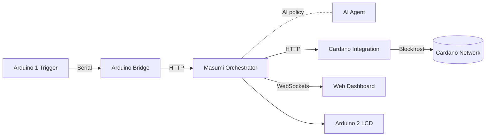
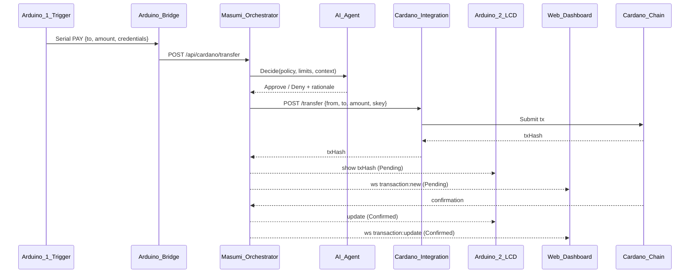
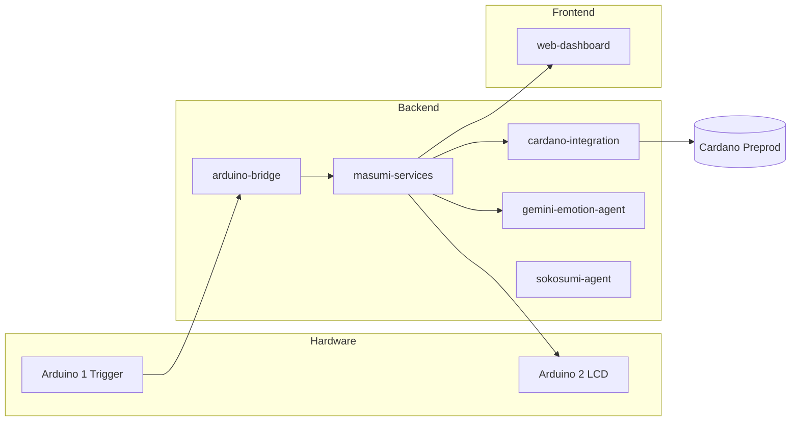

# Arduino ↔ Cardano ↔ Masumi: AI‑Agent Orchestrated Machine‑to‑Machine Demonstration


🚀 **A revolutionary hardware-to-blockchain integration where AI agents mediate machine-to-machine interactions on the Cardano blockchain**


## 🎯 **Project Overview**

This project demonstrates **AI-agent orchestrated machine-to-machine interaction** where:
- One machine (Arduino) requests a payment/action
- An AI agent interprets intent and authorizes the request
- Masumi orchestrates policy, limits, routing, and execution
- Cardano blockchain records the transaction
- Another machine (Arduino LCD) displays real-time status

**Machine (Arduino) → AI‑agent decision → Machine (Arduino)**
- AI‑agent mediated interaction becomes an on‑chain Cardano transaction
- Masumi handles orchestration; Cardano handles settlement


## 📸 **Project Screenshots**

### **Complete System Overview**

<div align="center">
  
  <p><em>Arduino-Cardano Integration System: Hardware setup, LCD display, and real-time dashboard</em></p>
</div>

---

### **Hardware Setup - Arduino Boards**

<div align="center">
  
  <p><em>Dual Arduino setup: Payment Trigger (COM6) with button and LEDs, Transaction Display (COM3) with I2C LCD</em></p>
</div>

---
### **Circuit Diagram - Arduino #1 (Transaction Display)**

<div align="center">
  
  <p><em>Arduino Uno #2 wiring: 16x2 I2C LCD connected to SDA (A4) and SCL (A5), Success LED on Pin 13, Processing LED on Pin 12, Error LED on Pin 11 pins</em></p>
</div>

---

### **Circuit Diagram - Arduino #2 (Payment Trigger)**

<div align="center">
  
  <p><em>Arduino Uno #1 wiring: Button on Pin 2 </em></p>
</div>

---

## 🧩 **What This Demonstrates**

### **AI‑Agent Powered M2M Flow**
- Arduino (button/sensor) requests a payment/interaction
- AI agent (Gemini/Sokosumi) interprets and authorizes intent based on context and policy
- Masumi orchestrates policy enforcement, limits, routing, and execution
- Cardano Integration service builds/signs/submits the on‑chain transaction
- Arduino (LCD) shows live status (Pending → Confirmed)

### **Key Innovations**
- ✅ Tangible blockchain feedback on 16×2 I2C LCD
- ✅ End‑to‑end microservices from serial to blockchain
- ✅ AI-driven decision making for autonomous payments
- ✅ Real Cardano preprod testnet transactions
- ✅ Production-ready microservices architecture

## 🏗️ **System Architecture**

### **High-Level Flow**



### **Detailed Sequence (Button Press → Confirmation)**



### **Component Map**



## 🔧 **Hardware Components**

### **Arduino #1 - Payment Trigger (COM6)**
- **Button**: Pin 2 (with pull-up resistor) - Initiates payment
- **LEDs**: 
  - Pin 13: Success indicator (transaction confirmed)
  - Pin 12: Processing indicator (transaction pending)
  - Pin 11: Error indicator (transaction failed)
- **Function**: Triggers payment commands via serial with embedded credentials
- **Credentials**: Stores sender address, recipient address, and signing key (CBOR hex)

### **Arduino #2 - Transaction Display (COM3)**
- **LCD I2C Display**: A4 (SDA), A5 (SCL) - Shows transaction status
- **Function**: Displays transaction hashes and status messages in real-time
- **Display Modes**: 
  - Pending transactions with truncated hash
  - Confirmed transactions with full details
  - Error messages and retry status

### **Optional: Plant Health Monitoring**
- **Soil Moisture Sensor**: Analog pin A0
- **Function**: Monitors plant health for AI-based analysis
- **Integration**: Data analyzed by Gemini-based AI for recommendations

## 💻 **Software Stack**

### **Microservices Architecture**
- **Arduino Bridge** (Port 5001): Serial communication gateway, handles COM6 & COM3
- **Masumi Payment** (Port 3001): Payment orchestration service with AI integration
- **Cardano Integration** (Port 4002): Blockchain transaction service (build/sign/submit)
- **Gemini Emotion Agent** (Port 7002): AI decision engine for plant health and context analysis
- **Sokosumi Agent** (Optional): Extended AI capabilities for research and complex decisions
- **Web Dashboard** (Port 8090): Real-time monitoring interface with WebSockets

### **Service Folders**
- `backend/arduino-bridge` — Serial ↔ HTTP gateway
- `backend/masumi-services` — Orchestration & policy enforcement
- `backend/cardano-integration` — Cardano tx build/sign/submit
- `backend/gemini-emotion-agent` — AI decision services
- `backend/sokosumi-agent` — Extended AI capabilities
- `frontend/web-dashboard` — Live tx and telemetry dashboard
- `keys/` — Preprod addresses, CBOR, wallet info
- `scripts/` — Wallet generation and test helpers

### **Technologies**
- **Backend**: Node.js, Express, Socket.IO, SerialPort
- **Database**: PostgreSQL (transactions), Redis (caching)
- **Blockchain**: Cardano Preprod Testnet via Blockfrost API
- **AI**: Google Gemini API, Sokosumi AI Platform
- **Hardware**: Arduino Uno, I2C LCD, Serial Communication
- **Containerization**: Docker Compose
- **Real-time**: WebSockets for live monitoring

## 🚀 **Key Features**

### ✅ **AI-Orchestrated Decision Making**
- AI agent interprets transaction intent and context
- Policy-based approval/denial with rationale
- Emotion analysis for plant health monitoring
- Dynamic decision making based on environmental factors

### ✅ **Physical Hardware Integration**
- Real Arduino button triggers blockchain transactions
- LCD display shows transaction hashes in real-time
- LED indicators for transaction status
- Multi-COM port management for dual Arduino coordination

### ✅ **Real-time Monitoring**
- Live web dashboard showing serial communication
- Transaction status tracking with WebSockets
- Wallet balance monitoring
- Plant health telemetry (optional)

### ✅ **Blockchain Integration**
- Real Cardano preprod testnet transactions (not simulated)
- Proper wallet generation and signing with CBOR encoding
- UTxO management and transaction building
- Blockfrost API integration for reliable submission

### ✅ **Microservices Architecture**
- Scalable Docker-based services
- Health monitoring and auto-restart
- Service discovery and communication
- Environment-based configuration

### ✅ **Credential Management on Arduino**
- Arduino #1 stores and transmits sender credentials securely
- Signing keys embedded in Arduino code (testnet only)
- Serial protocol includes `FROM_ADDRESS`, `TO_ADDRESS`, `SKEY_CBOR`
- Bridge forwards credentials to Masumi → Cardano Integration

## 📱 **Live Demo Flow**

1. **Press Arduino Button** → Physical button press detected on Arduino #1
2. **Serial Communication** → Commands + credentials sent via COM6
3. **AI Decision** → Gemini/Sokosumi AI interprets intent and approves/denies
4. **Payment Processing** → Arduino Bridge forwards to Masumi Payment service
5. **Blockchain Transaction** → Cardano Integration builds/signs/submits real tx
6. **Real-time Display** → Transaction hash shown on LCD (Arduino #2) and dashboard
7. **Confirmation** → LEDs indicate success/failure, LCD updates to "Confirmed"

---

## ⚙️ **Setup A: Local (Windows)**

### **Prerequisites**
- Node.js 18+
- Arduino IDE
- Blockfrost Preprod API key ([Get here](https://blockfrost.io/))
- Two COM ports (e.g., COM6 for trigger, COM3 for LCD)
- Python 3.8+ (for wallet generation)
- Git

### **Hardware Setup**
```bash
# Arduino #1 (Payment Trigger) - Connect to COM6
Button: Pin 2 → GND (with pull-up resistor)
Success LED: Pin 13 → 220Ω resistor → LED → GND
Processing LED: Pin 12 → 220Ω resistor → LED → GND
Error LED: Pin 11 → 220Ω resistor → LED → GND

# Arduino #2 (Transaction Display) - Connect to COM3
LCD I2C: SDA → A4, SCL → A5, VCC → 5V, GND → GND
I2C Address: 0x27 (default, adjust in code if different)
```

### **Software Setup (Local)**

#### **1. Clone and Setup**
```powershell
# Clone the repository
git clone https://github.com/DhanushKenkiri/IndiaCodexHackathon--25-Submission.git
cd IndiaCodexHackathon--25-Submission
```

#### **2. Install Service Dependencies**
```powershell
cd backend\masumi-services
npm install
cd ..\arduino-bridge
npm install
cd ..\cardano-integration
npm install
cd ..\gemini-emotion-agent
npm install
cd ..\..
```

#### **3. Configure Environments**
```powershell
# Copy environment templates
copy backend\arduino-bridge\.env.example backend\arduino-bridge\.env
copy backend\masumi-services\.env.example backend\masumi-services\.env
copy backend\cardano-integration\.env.example backend\cardano-integration\.env
copy backend\gemini-emotion-agent\.env.example backend\gemini-emotion-agent\.env
```

**Edit each `.env` file:**

**Arduino Bridge** (`backend/arduino-bridge/.env`):
```env
SERIAL_PORT=COM6
BAUD_RATE=9600
MASUMI_PAYMENT_URL=http://localhost:3001/api/cardano/transfer
```

**Cardano Integration** (`backend/cardano-integration/.env`):
```env
BLOCKFROST_PROJECT_ID=your_blockfrost_preprod_api_key
BLOCKFROST_URL=https://cardano-preprod.blockfrost.io/api/v0
CARDANO_NETWORK=preprod
```

**Gemini Emotion Agent** (`backend/gemini-emotion-agent/.env`):
```env
GEMINI_API_KEY=your_google_gemini_api_key
```

#### **4. Generate Cardano Wallet**
```powershell
cd scripts
python create_lucid_wallet.py
# Or use PowerShell script:
# .\generate-cardano-preprod-wallet.ps1
```

This creates a wallet in `keys/new-wallet/`:
- `address.txt` - Your preprod address
- `cbor_hex.txt` - Signing key in CBOR hex format
- `private_key_hex.txt` - Private key
- `wallet_info.json` - Complete wallet details

#### **5. Fund Your Wallet**
Visit [Cardano Testnet Faucet](https://testnets.cardano.org/en/testnets/cardano/tools/faucet/)
- Use address from `keys/new-wallet/address.txt`
- Request test ADA (usually 10,000 tADA)

#### **6. Configure Arduino #1 Credentials**

Edit `hardware/arduino-uno/payment_trigger.ino`:

```cpp
// Replace with your actual preprod addresses and signing key
const char* FROM_ADDRESS = "addr_test1..."; // From keys/new-wallet/address.txt
const char* TO_ADDRESS = "addr_test1...";   // Recipient address (can be same for testing)

// Option 1: Single-line CBOR (for shorter keys)
const char* SKEY_CBOR_SINGLE_LINE = "5820abcd1234..."; // From keys/new-wallet/cbor_hex.txt

// Option 2: Multi-line CBOR (for longer keys, remove SKEY_CBOR_SINGLE_LINE if using this)
// const char* SKEY_CBOR_START = "5820";
// const char* SKEY_CBOR_LINE1 = "abcd1234...";
// const char* SKEY_CBOR_LINE2 = "efgh5678...";
// const char* SKEY_CBOR_END = "";
```

**Security Note**: This is for hackathon/testnet demos only. Never embed mainnet keys in hardware.

#### **7. Start Services**

Open **4 separate PowerShell terminals**:

**Terminal 1 - Masumi Payment Service**:
```powershell
cd backend\masumi-services
npm start
# Should see: "Masumi Payment Service listening on port 3001"
```

**Terminal 2 - Arduino Bridge**:
```powershell
cd backend\arduino-bridge
npm start
# Should see: "Arduino Bridge listening on port 5001" and "Serial port COM6 opened"
```

**Terminal 3 - Cardano Integration**:
```powershell
cd backend\cardano-integration
npm start
# Should see: "Cardano Integration Service listening on port 4002"
```

**Terminal 4 - Gemini Emotion Agent**:
```powershell
cd backend\gemini-emotion-agent
npm start
# Should see: "Gemini Emotion Agent listening on port 7002"
```

#### **8. Upload Arduino Sketches**

Open Arduino IDE:
- Upload `hardware/arduino-uno/payment_trigger.ino` to Arduino #1 (COM6)
- Upload `hardware/arduino-uno/transaction_display.ino` to Arduino #2 (COM3)

Verify serial monitors show "Ready" messages.

#### **9. Start Web Dashboard**
```powershell
cd frontend\web-dashboard
npm install
npm start
```
Open http://localhost:8090 in your browser.

#### **10. Test the System**
- Press the button on Arduino #1
- Watch the AI agent decision in Terminal 1 (Masumi logs)
- See transaction hash on LCD (Arduino #2)
- Monitor live updates on the web dashboard
- LEDs indicate: Processing (Pin 12) → Success (Pin 13) or Error (Pin 11)

---

## 🐳 **Setup B: Docker Compose**

### **Prerequisites**
- Docker Desktop (Windows/Mac/Linux)
- Arduino IDE (for uploading sketches)

**Note**: On Windows, COM port access from Docker is limited. We recommend running `arduino-bridge` locally and containerizing other services.

### **Setup Steps**

#### **1. Configure Docker Compose**

The repository includes a `docker-compose.yml`. Verify/edit if needed:

```yaml
version: "3.9"
services:
  masumi-services:
    build: ./backend/masumi-services
    ports: ["3001:3001"]
    env_file:
      - ./backend/masumi-services/.env
    restart: unless-stopped

  cardano-integration:
    build: ./backend/cardano-integration
    ports: ["4002:4002"]
    env_file:
      - ./backend/cardano-integration/.env
    depends_on: [masumi-services]
    restart: unless-stopped

  gemini-emotion-agent:
    build: ./backend/gemini-emotion-agent
    ports: ["7002:7002"]
    env_file:
      - ./backend/gemini-emotion-agent/.env
    restart: unless-stopped

  web-dashboard:
    build: ./frontend/web-dashboard
    ports: ["8090:8090"]
    depends_on: [masumi-services, cardano-integration]
    restart: unless-stopped

  # Note: arduino-bridge runs locally on Windows for COM access
  # On Linux, uncomment and configure devices:
  # arduino-bridge:
  #   build: ./backend/arduino-bridge
  #   ports: ["5001:5001"]
  #   env_file:
  #     - ./backend/arduino-bridge/.env
  #   devices:
  #     - "/dev/ttyUSB0:/dev/ttyUSB0"  # COM6 equivalent
  #     - "/dev/ttyUSB1:/dev/ttyUSB1"  # COM3 equivalent
  #   group_add:
  #     - dialout
  #   depends_on: [masumi-services]
```

#### **2. Build and Start Services**
```powershell
# Build all Docker images
docker compose build

# Start services in detached mode
docker compose up -d

# Check service status
docker compose ps

# View logs
docker compose logs -f masumi-services
docker compose logs -f cardano-integration
```

#### **3. Start Arduino Bridge Locally (Windows)**
```powershell
cd backend\arduino-bridge
npm install
npm start
```

#### **4. Upload Arduino Sketches**
- Upload `hardware/arduino-uno/payment_trigger.ino` → Arduino #1 (COM6)
- Upload `hardware/arduino-uno/transaction_display.ino` → Arduino #2 (COM3)

#### **5. Access Services**
- Web Dashboard: http://localhost:8090
- Masumi Payment API: http://localhost:3001/health
- Cardano Integration API: http://localhost:4002/health
- Arduino Bridge API: http://localhost:5001/health

### **Docker Management Commands**
```powershell
# Stop all services
docker compose down

# Restart a specific service
docker compose restart masumi-services

# View logs for a service
docker compose logs -f cardano-integration

# Rebuild after code changes
docker compose up -d --build

# Remove all containers and volumes
docker compose down -v
```

---

## 🔐 **Serial Protocol & Credential Flow**

### **Arduino → Bridge Serial Protocol**

Arduino #1 transmits over serial:

```
TRIGGER_PAYMENT
FROM_AGENT:satoshi_alpha_001
TO_AGENT:satoshi_beta_002
AMOUNT:1
FROM_ADDRESS:addr_test1qv...
TO_ADDRESS:addr_test1qq...
SKEY_CBOR:5820abcd1234...
EMOTION:I am excited!
END_COMMAND
```

**Multi-line CBOR variant** (for long keys):
```
TRIGGER_PAYMENT
FROM_AGENT:satoshi_alpha_001
TO_AGENT:satoshi_beta_002
AMOUNT:1
FROM_ADDRESS:addr_test1qv...
TO_ADDRESS:addr_test1qq...
SKEY_CBOR_START
5820
abcd1234...
efgh5678...
SKEY_CBOR_END
EMOTION:I am excited!
END_COMMAND
```

### **Bridge → Masumi HTTP API**

Arduino Bridge forwards to Masumi Payment:

```http
POST http://localhost:3001/api/cardano/transfer
Content-Type: application/json

{
  "fromAgent": "satoshi_alpha_001",
  "toAgent": "satoshi_beta_002",
  "amountAda": 1,
  "fromAddress": "addr_test1qv...",  // Override from Arduino
  "toAddress": "addr_test1qq...",    // Override from Arduino
  "skeyCbor": "5820abcd1234...",     // Override from Arduino
  "emotion": "I am excited!"
}
```

### **Masumi → Cardano Integration HTTP API**

After AI approval, Masumi calls Cardano Integration:

```http
POST http://localhost:4002/transfer
Content-Type: application/json

{
  "fromAddress": "addr_test1qv...",
  "toAddress": "addr_test1qq...",
  "amountAda": 1,
  "skeyCbor": "5820abcd1234..."
}
```

Cardano Integration builds, signs, and submits the transaction, returning `txHash`.

---

## 📡 **API Endpoints**

### **Arduino Bridge Service (Port 5001)**
- `GET /health` - Service health check
- `POST /simulate` - Manual payment trigger (testing)
- `GET /simulate` - Alternative GET endpoint for browser testing
- `GET /plant-status` - Latest plant metrics (if Arduino sends sensor data)
- `POST /request-plant-data` - Request Arduino to send latest metrics
- WebSocket events for real-time serial communication

### **Masumi Payment Service (Port 3001)**
- `GET /health` - Service health check
- `POST /api/cardano/transfer` - Create payment (with optional overrides: `fromAddress`, `toAddress`, `skeyCbor`)
- `GET /api/latest-transaction` - Get last submitted transaction summary
- `GET /api/cardano/balance/:address` - Check wallet balance for an address
- WebSocket broadcasting for transaction events

### **Cardano Integration Service (Port 4002)**
- `GET /health` - Service health check
- `POST /transfer` - Execute blockchain transaction (called by Masumi)
  - Request body: `{ fromAddress, toAddress, amountAda, skeyCbor }`
  - Returns: `{ txHash, status }`
- `GET /balance/:address` - Get wallet balance from Blockfrost

### **Gemini Emotion Agent Service (Port 7002)**
- `GET /health` - Service health check
- `POST /analyze` - Analyze text for emotional context
  - Request body: `{ text, context }`
  - Returns: `{ emotion, sentiment, recommendations }`
- `POST /plant-health` - Analyze plant health from sensor data
  - Request body: `{ moistureLevel, temperature, context }`
  - Returns: `{ healthStatus, recommendations, wateringAdvice }`

---

## ✅ **Quick Test Commands**

### **Manual Trigger (No Arduino)**
```powershell
# Trigger a test transaction
curl -X POST http://localhost:5001/simulate

# Or in browser
http://localhost:5001/simulate
```

### **Health Checks**
```powershell
curl http://localhost:5001/health  # Arduino Bridge
curl http://localhost:3001/health  # Masumi Payment
curl http://localhost:4002/health  # Cardano Integration
curl http://localhost:7002/health  # Gemini Emotion Agent
```

### **Check Wallet Balance**
```powershell
curl http://localhost:3001/api/cardano/balance/addr_test1qv...
```

### **View Latest Transaction**
```powershell
curl http://localhost:3001/api/latest-transaction
```

---

## 🏆 **Innovation Highlights**

### 🌟 **AI-Orchestrated Hardware-Blockchain Bridge**
First-of-its-kind integration where AI agents mediate between physical Arduino hardware and Cardano blockchain, making intelligent decisions based on context, policy, and emotional analysis.

### 🌟 **Autonomous Decision Making**
AI agents (Gemini/Sokosumi) interpret transaction intent, enforce policies, and provide rationale for approve/deny decisions without human intervention.

### 🌟 **Real-time Dual Arduino Architecture**
Separate boards for input (trigger with credentials) and output (LCD display) with coordinated serial communication and visual feedback.

### 🌟 **Credentials on Edge Device**
Arduino #1 stores and transmits wallet credentials securely over serial, demonstrating edge-based key management for IoT blockchain applications (testnet only).

### 🌟 **Production-Ready Microservices**
Complete Docker-based architecture with health monitoring, WebSocket communication, PostgreSQL persistence, and proper error handling.

---

## 📊 **Technical Achievements**

- ✅ **Real Blockchain Transactions**: Not simulated - actual Cardano preprod transactions with UTxO management
- ✅ **Multi-COM Port Management**: Simultaneous communication with two Arduino boards (COM6, COM3)
- ✅ **AI-Powered Decision Engine**: Gemini-based emotion analysis and policy enforcement
- ✅ **Real-time WebSocket Communication**: Live dashboard updates for transaction status
- ✅ **Containerized Deployment**: Full Docker Compose stack with auto-restart and health checks
- ✅ **Proper Cardano Wallet Integration**: CBOR key encoding, address derivation, transaction signing
- ✅ **Edge-Based Credential Management**: Arduino stores and transmits signing keys securely (testnet)

---

## 🔐 **Security Features**

- **Environment-based Configuration**: Sensitive keys in `.env` files (not committed)
- **Testnet-Only Operations**: Hardcoded testnet network prevents mainnet accidents
- **Proper CBOR Key Formatting**: Industry-standard Cardano key encoding
- **Health Check Monitoring**: Automated service health verification
- **Admin Token Protection**: Sensitive endpoints require authentication (optional)
- **Serial Protocol Validation**: Arduino Bridge validates all serial commands
- **AI Approval Gate**: Masumi requires AI agent approval before executing transactions

**Security Note**: The Arduino credential embedding is for hackathon/testnet demonstrations only. Production systems should use secure enclaves, HSMs, or remote signing services for mainnet operations.

---

## 🛠️ **Troubleshooting**

### **Common Issues**

#### **1. COM Port Issues**
**Problem**: Arduino Bridge can't open COM6 or COM3
**Solution**:
- Close Arduino IDE Serial Monitor (it locks the port)
- Verify correct COM port in Device Manager (Windows)
- Update `SERIAL_PORT` in `backend/arduino-bridge/.env`
- Check Arduino is powered and connected via USB

#### **2. LCD Display Blank**
**Problem**: Arduino #2 LCD shows no text
**Solution**:
- See `docs/LCD_TROUBLESHOOTING.md` for detailed wiring diagrams
- Verify I2C address (default 0x27, check with I2C scanner sketch)
- Adjust LCD contrast potentiometer on I2C backpack
- Check SDA → A4, SCL → A5 connections
- Verify 5V and GND connections

#### **3. No Transaction on Blockchain**
**Problem**: Button press doesn't create transaction
**Solution**:
- Verify `MASUMI_PAYMENT_URL` in Arduino Bridge `.env`
- Check Blockfrost API key in Cardano Integration `.env`
- Ensure wallet has sufficient test ADA (check faucet)
- View Masumi logs for AI approval status
- Check Arduino #1 has correct addresses and CBOR key

#### **4. Docker Services Not Starting**
**Problem**: `docker compose up` fails
**Solution**:
- Ensure Docker Desktop is running
- Check `.env` files exist in each service folder
- View logs: `docker compose logs -f service-name`
- Rebuild: `docker compose up -d --build`
- Check port conflicts (3001, 4002, 7002, 8090)

#### **5. AI Agent Errors**
**Problem**: Gemini Emotion Agent returns errors
**Solution**:
- Verify `GEMINI_API_KEY` in `.env`
- Check API quota/billing at [Google AI Studio](https://makersuite.google.com/)
- Review logs: `docker compose logs -f gemini-emotion-agent`
- Ensure proper JSON formatting in requests

#### **6. Serial Communication Issues**
**Problem**: Arduino Bridge doesn't receive commands
**Solution**:
- Open Arduino IDE Serial Monitor and send test command manually
- Verify baud rate matches (9600 in code and `.env`)
- Check Arduino #1 sketch uploaded correctly
- Review Bridge logs for parsing errors
- Test with `/simulate` endpoint first

### **Debugging Commands**
```powershell
# Check Docker services
docker compose ps

# View real-time logs
docker compose logs -f masumi-services
docker compose logs -f cardano-integration

# Restart a service
docker compose restart masumi-services

# Check Arduino connectivity (Arduino IDE Serial Monitor)
# Open Serial Monitor on COM6 and COM3, send:
# TRIGGER_PAYMENT
# FROM_AGENT:test
# TO_AGENT:test
# AMOUNT:1
# END_COMMAND
```

### **Debug Endpoints**
```powershell
# Test Arduino Bridge
curl http://localhost:5001/health
curl -X POST http://localhost:5001/simulate

# Test Masumi Payment
curl http://localhost:3001/health
curl http://localhost:3001/api/latest-transaction

# Test Cardano Integration
curl http://localhost:4002/health
curl http://localhost:4002/balance/addr_test1qv...

# Test Gemini Emotion Agent
curl http://localhost:7002/health
curl -X POST http://localhost:7002/analyze -H "Content-Type: application/json" -d "{\"text\":\"I am happy!\",\"context\":\"test\"}"
```

---

## 👥 **Team & Development**

- **Hardware Integration**: Arduino programming, circuit design, serial communication
- **Blockchain Development**: Cardano wallet management, transaction building, Blockfrost integration
- **AI Integration**: Gemini API, emotion analysis, policy enforcement, Sokosumi platform
- **Full-Stack Development**: Microservices architecture, WebSocket communication, real-time dashboard
- **DevOps**: Docker containerization, service orchestration, health monitoring


---

## 📚 **Additional Documentation**

- `docs/setup-guide.md` - Detailed setup instructions
- `docs/api-documentation.md` - Complete API reference
- `docs/hardware-wiring.md` - Hardware connection diagrams and schematics
- `docs/LCD_TROUBLESHOOTING.md` - LCD display debugging guide
- `docs/LCD_WIRING_FIX.md` - Common wiring mistakes and fixes
- `docs/SOIL_MOISTURE_WIRING.md` - Plant sensor integration guide
- `DEPLOYMENT_STATUS.md` - Service deployment status and architecture
- `SOKOSUMI_INTEGRATION_STATUS.md` - Sokosumi AI platform integration details


